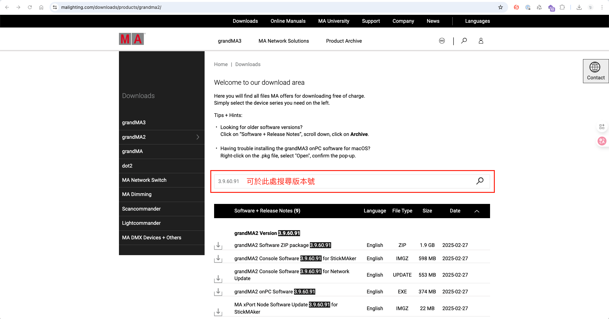

# gma2-plugins

A development workspace for **grandMA2 lighting-console plugins**, written in **Lua**. The goal is to use AI to generate plugins that drive grandMA2's native command syntax, so lighting designers spend less time on repetitive programming and memorizing keywords.

## Table of Contents

- [Overview](#overview)
- [Features](#features)
- [Getting Started](#getting-started)
  - [Prerequisites](#prerequisites)
  - [Installation](#installation)
  - [Usage](#usage)
- [Project Structure](#project-structure)
- [Plugin Development](#plugin-development)
- [Building a Release](#building-a-release)
- [Reference and Learning Resources](#reference-and-learning-resources)
- [Contributing](#contributing)
- [License](#license)

## Overview

grandMA2 is the mainstream lighting-programming software in Taiwan and much of the industry. It has its own [command syntax and keywords](https://help2.malighting.com/Page/grandMA2/command_syntax_and_keywords/en/3.9), and it can be extended with plugins written in Lua.

The [official plugin documentation](https://help2.malighting.com/Page/grandMA2/plugins_edit/pt/3.3), however, does not publicly document which API functions are available or how to write a compatible plugin -- it only states that Lua can be used. As a result, most plugins are written and shared by the lighting community rather than documented officially.

This repository takes the position that AI tooling can help close that gap: generate plugins that operate grandMA2's native command language, and in doing so reduce the repetitive work and keyword memorization that lighting programmers would otherwise carry. It collects the project's own first-party plugins, community plugins kept for study, and official reference material in one place.

> grandMA2 runs only on **Windows**, and plugins execute **inside the console**. They cannot be run or tested from this repository -- iteration is: edit the Lua/XML here, import it into a grandMA2 console (or onPC), then run it and observe the System Monitor (`gma.echo`) output there.

## Features

The first-party plugins maintained in this repository. Both were split out of an earlier *Edit Cue Info* plugin and target grandMA2 **3.9.60**.

- **Update Info** -- Reads and edits the **Info** field of a cue through a text-input dialog. Leaving the input empty clears the cue's Info. On first run it auto-installs a same-named macro for quick access.

- **Append Info** -- Appends text to a cue's existing **Info** field, using `/` as a separator so previous notes are preserved.

Prebuilt downloads for these plugins are attached to each [GitHub release](https://github.com/chienchuanw/gma2-plugins/releases).

## Getting Started

### Prerequisites

- A **grandMA2** console or **grandMA2 onPC** (Windows only). Plugins in this repo target version **3.9.60**; the XML schema version must match your console.
- To open the bundled community archives: a tool that can extract `.zip` and `.rar` files.

### Installation

Each plugin is a pair of files: a `.lua` script and an `.xml` descriptor that the console imports. The descriptor's `luafile=` attribute names the Lua file, so the two must keep their original filenames and stay together.

1. Download a plugin's `.zip` from the [Releases](https://github.com/chienchuanw/gma2-plugins/releases) page and unzip it (or take the `.lua` + `.xml` pair directly from `plugins/<name>/`).
2. In grandMA2, import the `.xml` -- it loads the paired `.lua`.
3. Run the plugin from the Plugin pool.

### Usage

Run **Update Info** to read or change the selected cue's Info field; submit an empty value to clear it. Run **Append Info** to add a note to a cue's Info without overwriting what is already there. The first run of a plugin installs a same-named macro you can use as a shortcut afterwards.

## Project Structure

```text
gma2-plugins/
├── plugins/                  # First-party plugins (one folder per plugin)
│   ├── update-info/          #   Update Info.lua + Update Info.xml
│   └── append-info/          #   Append Info.lua + Append Info.xml
├── third-party/              # Community plugins, kept for study and attribution
│   ├── layoutfx/             #   extracted source + original archive
│   ├── midi-twister/
│   ├── presets-to-offsets/
│   └── recast-preset/
├── reference/                # Official and learning material
│   ├── ma-samples/           #   grandMA2 sample plugin + API reference (plugin_1)
│   ├── systemtests/          #   official MA console self-test scripts
│   ├── socket/               #   LuaSocket library (for networking plugins)
│   └── lua-lessons/          #   Lua tutorial PDFs
├── sandbox/                  # Unfinished experiments (color.lua, no .xml yet)
├── scripts/                  # build-release.sh — packages plugins into dist/
├── images/                   # README assets
├── CLAUDE.md                 # Guidance for AI agents working in this repo
├── LICENSE                   # MIT (first-party work only)
└── THIRD-PARTY-NOTICES.md    # Attribution and terms for bundled material
```

`plugins/` holds the work this repository owns and releases. `third-party/` keeps community plugins for reference -- each folder contains both the readable extracted source and the author's original release archive (see [Third-Party Notices](./THIRD-PARTY-NOTICES.md) for terms). `reference/` is read-only material: official MA samples and self-tests, the LuaSocket library, and Lua lesson PDFs.

## Plugin Development

Every plugin is a `.lua` script plus an `.xml` descriptor that the console imports:

```xml
<MA ...>
    <Plugin index="0" execute_on_load="0" name="My Plugin" luafile="My Plugin.lua" />
</MA>
```

The XML's schema version (`major_vers` / `minor_vers` / `stream_vers` and the `MA.xsd` path) must match the target console version. When creating a new plugin, copy these from an existing `.xml` that targets the same version rather than inventing them.

The Lua file contract:

- It receives its names as varargs: `local internal_name = select(1, ...)` and `local visible_name = select(2, ...)`.
- It **must `return Start, Cleanup`** at the end. `Start` is the entry point invoked when the plugin runs; `Cleanup` is optional and runs on termination.

Plugins interact with the console exclusively through the global `gma` table -- most notably `gma.cmd("...")` to execute a native command-line string, plus `gma.echo` / `gma.feedback` for logging, `gma.show.getobj.*` / `gma.show.property.*` to read showfile objects, and `gma.gui.*` / `gma.textinput` for dialogs. `reference/ma-samples/plugin_1.lua` is the most complete reference for the available API surface, since no official API documentation exists publicly.

## Building a Release

`scripts/build-release.sh` packages each first-party plugin's `.lua` + `.xml` pair into `dist/<name>.zip` (filenames preserved so the console resolves `luafile=` on import):

```bash
./scripts/build-release.sh
gh release create vX.Y.Z --target main dist/*.zip
```

The `dist/` directory is build output and is gitignored.

## Reference and Learning Resources

There is little public material on writing grandMA2 plugins. The following are useful starting points:

- A rare [plugin tutorial video](https://www.youtube.com/watch?v=YSSFk0eU0gg) (mostly basic Lua syntax).
- [GrandMA2 LUA Reference](https://static.impactsf.com/GrandMA2/index.html)
- [grandMA2 Wiki](https://grandma2.fandom.com/wiki/Object_space_crawler_script)
- [CDS - MA2 Lua](https://caodashi.com/ma-lua)
- [grandMA2 Plugins & Lua Scripts official forum](https://forum.malighting.com/forum/board/41-grandma2-plugins-lua-scripts/)

The Lua tutorial PDFs under `reference/lua-lessons/` cover setup, variables, tables, control flow, and functions.

grandMA2 runs only on Windows. The latest version at the time of writing is 3.9.60.91; you can get the console and onPC software from the [official download page](https://www.malighting.com/downloads/products/grandma2/).



## Contributing

Issues and pull requests are welcome. The default working branch is `dev`; pull requests target `main`. Please keep first-party plugin `.lua`/`.xml` filenames unchanged so the console can still resolve `luafile=` on import, and add new community plugins under `third-party/<name>/` with their original archive and an entry in [THIRD-PARTY-NOTICES.md](./THIRD-PARTY-NOTICES.md).

There is no build system or local test runner -- grandMA2 plugins can only be exercised inside the console, so treat all testing as manual on-console.

## License

The first-party work in this repository is licensed under the [MIT License](./LICENSE). That license applies **only** to the original work authored by the repository owner. Bundled community plugins, official MA material, and the Lua PDFs remain under their respective owners' terms -- see [THIRD-PARTY-NOTICES.md](./THIRD-PARTY-NOTICES.md).
